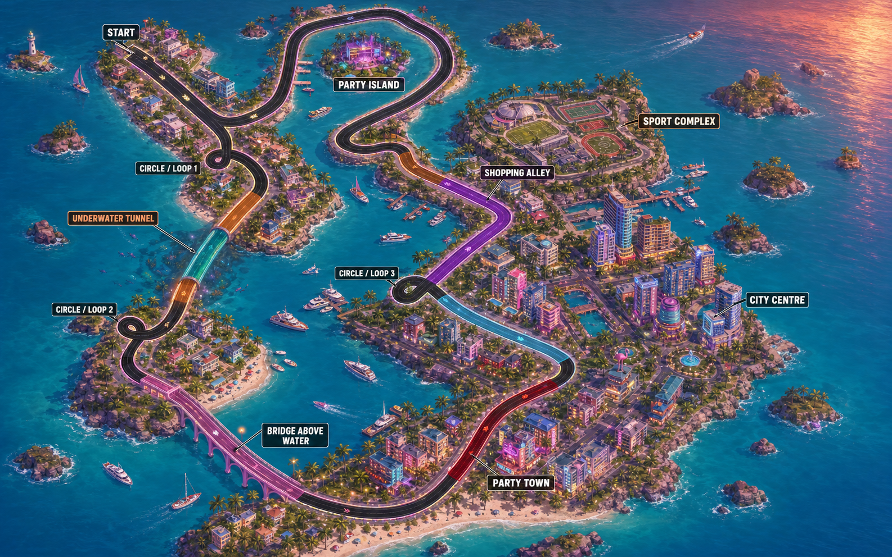

# Serega Island course map

This map is the visual source of truth for the next track implementation. The
original layout sketch is preserved at `tools/map template.png`.

## Lap order

The lap starts in the northwest and follows this order:

1. Start / finish coastal strip
2. Circle / Loop 1
3. Underwater Tunnel
4. Circle / Loop 2
5. Bridge Above Water
6. Party Town
7. City Centre
8. Circle / Loop 3
9. Shopping Alley
10. Sport Complex
11. Northern coastal return around Party Island
12. Start / finish

Party Island is an off-track landmark inside the northern return. It must be
visible from the circuit but must never become part of the racing line.

## Implementation rules

- Build the new track from an ordered 3D curve and measure progress by baked
  curve distance. Do not derive progress from a world axis.
- Preserve the relative lengths and positions of the colored sectors in the
  source sketch.
- Make all three loop features driveable at racing speed. Circle / Loop 3 must
  use vertical separation at its crossing.
- The bridge must visibly rise above open water. The underwater tunnel must
  visibly descend through portals below the waterline.
- Ground scenery against its island or district terrain, never against road
  elevation. Buildings must use recognizable silhouettes and entrances rather
  than generic floating boxes.
- Keep the first map-driven track build entirely obstacle-free. Road boundaries
  may remain for drivability testing.
- Treat the concept art as the environment and district guide. Exact road
  geometry will be encoded as control points so the implementation remains
  deterministic and testable.

## Visual districts

- **Start coast:** pastel villas, palms, lighthouse, and coastal overlooks.
- **Underwater sector:** reef, fish, glass or illuminated tunnel structure.
- **Bridge sector:** long open-water crossing with supports and visible height.
- **Party Town:** dense neon nightlife blocks and beach venues.
- **City Centre:** taller art-deco towers, civic plazas, and lit streets.
- **Shopping Alley:** compact storefront rows, awnings, and narrow side alleys.
- **Sport Complex:** stadium, courts, pools, and landscaped grounds.
- **Party Island:** separate beach-club island with docks and boats.
- **Unmarked coast:** marina, hotel strip, quiet villa pockets, beaches, palms,
  small islets, and scenic ocean views.

